# EkDaam

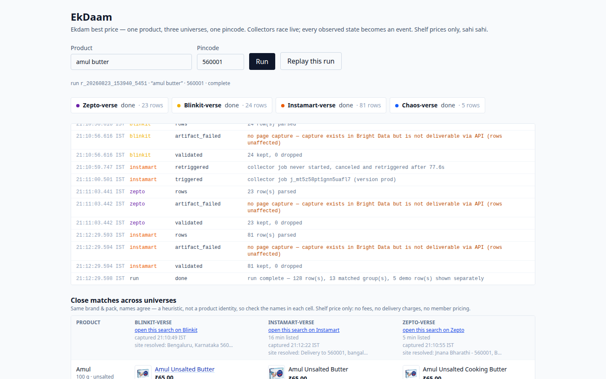

**[Watch the demo](https://youtu.be/lyB69pgtWZ8)** (2 min 48 s): a live crawl
across all four universes, the receipt, the store flip, and a real Bright Data
self-heal, end to end. The same video is committed at
[docs/demo.mp4](docs/demo.mp4).

<details>
<summary><strong>Screenshots</strong>: the landing, a live run, the receipt, the two chaos DOMs, the break, the heal</summary>
<br>

| | |
| --- | --- |
| 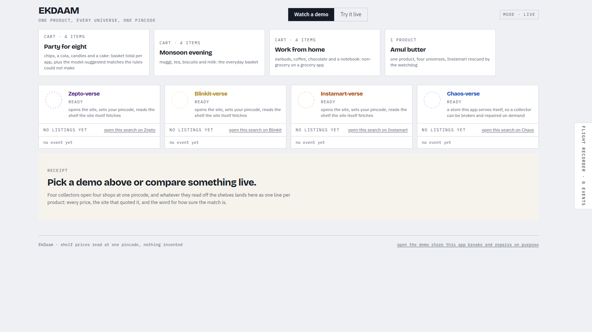 *The landing: watch a demo, or run one live* | 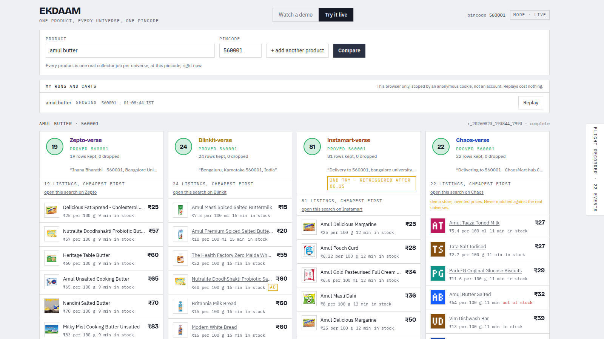 *A live run: every universe proves the pincode; the watchdog pill shows a rescued job* |
| 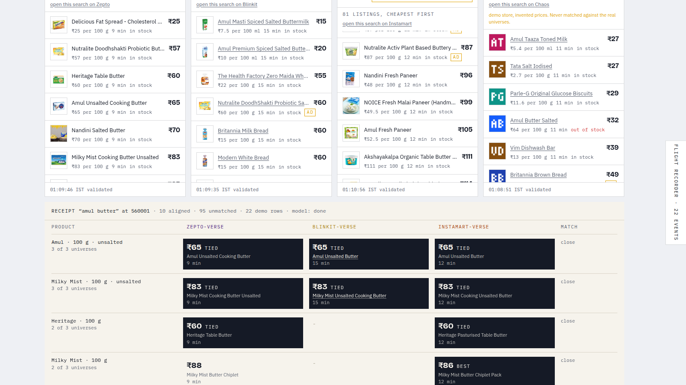 *The receipt: solid paylines, cheapest cell lit, labels say close, never exact* | 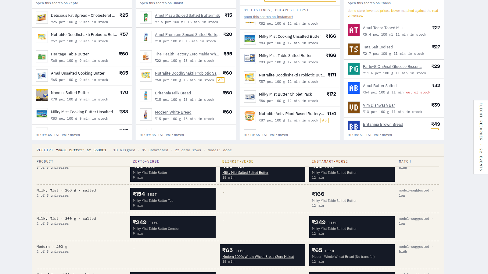 *Model-suggested matches: dashed, labelled with confidence, never mixed into the rules* |
| 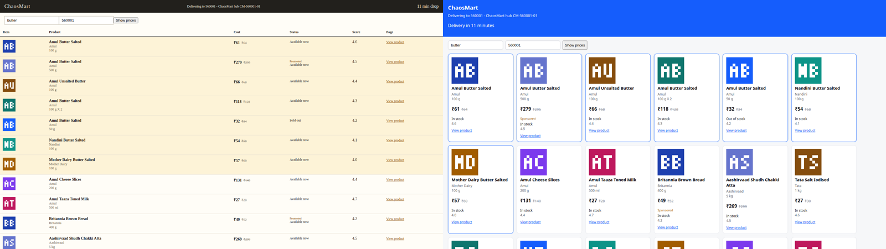 *One catalogue, two DOMs: the table and the card grid* | 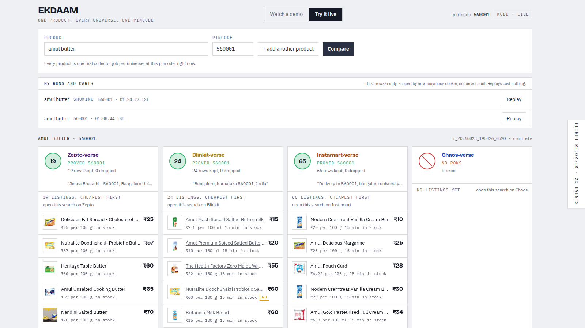 *After the flip: the chaos collector is blind, the other three unaffected* |
| 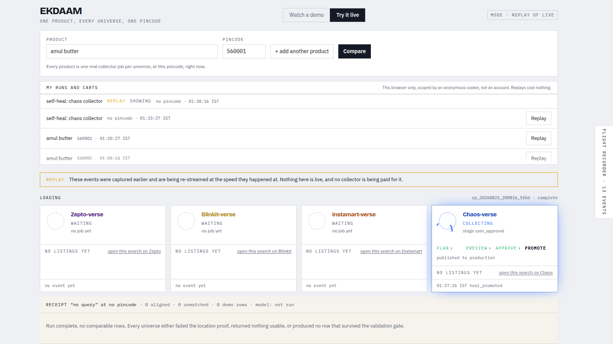 *The self-heal replay: plan, preview, approve, promote, published to production* | 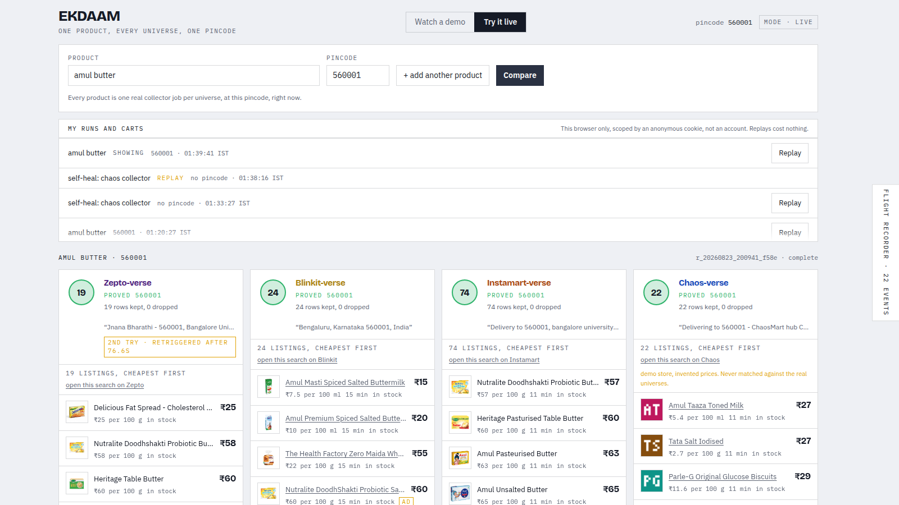 *Healed: the same collector reads the new DOM, rows are back* |

</details>

EkDaam compares grocery shelf prices across Zepto, Blinkit and Instamart for one
product and pincode. A fourth universe is a demo store the app serves itself,
built to break on purpose so a collector can be broken and self-healed while you
watch. Every row on a live run was captured by a Bright Data Scraper Studio
collector; the app has no scraping code of its own.

Built for Into the Scrape-Verse, the hackathon run by WeMakeDevs with Bright
Data. Live at <https://ekdaam.duckdns.org>.

## What it does

- Runs the wired Scraper Studio collectors in parallel per search, all four on
  the live deployment, and streams each collector's lifecycle into the browser
  as it happens.
- Normalizes prices, pack sizes, stock state, delivery estimates and
  sponsorship into one comparison receipt.
- Groups listings only when brand, pack size, variant and product names agree.
  Groups are labelled `close`, never `exact`, the original listing names stay
  visible so every match can be checked, and unmatched products are shown on
  their own instead of being forced into a comparison.
- Draws a second, labelled layer of model-suggested matches beside the
  rule-based receipt, never mixed into it. The model only ever returns product
  ids, every suggestion is re-checked by the same deterministic guards (same
  brand and pack size, different shops, no id used twice), and the layer is off
  unless `OPENROUTER_API_KEY` is set.
- Compares a whole cart: up to six products at one pincode run together, with
  the basket total per app and how many of the items each app could price.
- Stores each run so it can be replayed from the UI, and serves a curated list
  of real captures as the **Watch a demo** strip anyone can open, with no run
  of your own and no collector being paid for.

## How I used Scraper Studio

Scraper Studio is the whole data layer. The project has four collectors: three
in production against the live apps on Browser workers, and one against the
demo store on a Code worker. A search runs every collector that is wired, which
on the live deployment is all four.

- **Typed inputs, not URLs.** Every collector takes `{keyword, pincode}` and
  nothing else. The shelf does not exist at a URL; it exists only after a
  location is set in the session.
- **Location choreography on the Browser worker.** Each production collector
  opens the app, types the pincode into the site's own location picker, picks a
  suggestion, and reads back the location text the site itself resolved before
  it searches. A row only counts if that resolved text echoes the requested
  pincode.
- **The site's own JSON, not class names.** After the location bind,
  `tag_response` captures the search endpoint each app calls for itself, and
  the interaction script builds the rows from that payload; the parsers stay
  thin and return DOM facts. Hashed class names rotate; the API contract does
  not.
- **One output contract.** All four collectors emit the same 18 fields with the
  same types, prices as Studio's `Money`, so the app has one mapper and one
  comparison.
- **The REST loop, with a watchdog.** The app triggers with
  `POST /dca/trigger`, follows `GET /dca/log/{job}` for progress, and fetches
  `GET /dca/dataset`. A job that never starts navigating is cancelled and
  retriggered once; the watchdog has rescued live runs.
- **Self-healing, end to end.** Flipping the demo store's markup breaks the
  chaos collector. The app then runs Studio's `refactor_template` and
  `resume_automation_job` with `auto_save`, streams every stage into the run
  feed, and promotes the healed template only when Bright Data reports
  `save_new_template` as completed. A real heal has completed live in under
  five minutes.
- **A Code worker where a browser is not needed.** The chaos collector fetches
  server-rendered HTML over plain HTTP and parses it with cheerio, one page
  load per run.

### Studio functions used

| Layer | Functions |
| --- | --- |
| Interaction | `navigate`, `type`, `click`, `el_exists`, `wait_visible`, `wait_hidden`, `wait_page_idle`, `wait_network_idle`, `wait_for_parser_value`, `tag_response`, `tag_screenshot`, `html`, `parse`, `collect`, `blocked`, `bad_input`, `country`, `Money` |
| Parser | `$` (cheerio over the rendered DOM), `Money`, `Image` |
| REST | `POST /dca/trigger`, `GET /dca/log/{job}`, `GET /dca/dataset`, `POST /dca/jobs/{job}/cancel` |
| Self-heal | `refactor_template`, `resume_automation_job` with `auto_save`; promotion waits for the reported `save_new_template` step |

Not every collector uses every call. Instamart waits on `wait_visible` because
Swiggy's network never goes idle and each `wait_network_idle` there burnt
Studio's 30 second cap; Zepto and Blinkit wait on `wait_network_idle` with an
ignore list. The collector source, the 18-field contract and the worker notes
are in [`collectors/`](collectors/README.md). Collector IDs and API keys stay
in the environment.

## The chaos store

The app serves its own demo store at `/chaos`: one invented catalogue, two
structurally different renderings. Flipping between them breaks the collector
that reads the store, which is what makes a self-healing run something you can
watch on demand. Rows from this store are shown under their own heading and
never matched against the live universes, because its products and prices are
invented.

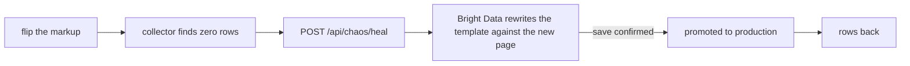

`./chaos-monkey.sh` prints the version being served and flips it to the next
one. Add `--heal` to start a self-heal run instead and print its run id. It
reads `CHAOS_ADMIN_TOKEN` from the environment and takes `EKDAAM_URL` for a
host other than the default.

## Run locally

Requirements:

- Python 3.12
- Node.js 22
- [uv](https://docs.astral.sh/uv/)

Install dependencies and build the frontend:

```bash
uv sync --frozen
npm --prefix web ci
npm --prefix web run build
```

Copy the environment template and start the server:

```bash
cp .env.example .env
uv run uvicorn server.app:app --port 8000
```

Open <http://127.0.0.1:8000>.

The default `BD_MODE=mock` uses a local Zepto fixture and makes no network
calls. For live comparisons, configure live mode.

## Live mode

Set these values in `.env`:

```dotenv
BD_MODE=live
BD_API_KEY=
SVERSE_COLLECTOR_ZEPTO=
SVERSE_COLLECTOR_BLINKIT=
SVERSE_COLLECTOR_INSTAMART=
SVERSE_COLLECTOR_CHAOS=
SVERSE_COLLECTOR_VERSION=prod
SVERSE_CHAOS_VERSION=v1
SVERSE_CHAOS_ADMIN_TOKEN=
SVERSE_DEMO_RUN_ID=
SVERSE_DEMO_FILE=runs/demo.json
OPENROUTER_API_KEY=
SVERSE_MAX_CONCURRENT_RUNS=6
```

- `SVERSE_COLLECTOR_CHAOS` is the demo store's collector; left empty, that
  universe reports "not wired" and takes no part in a run.
- `SVERSE_CHAOS_VERSION` is the rendering the demo store starts on, changed at
  runtime only through `POST /api/chaos/flip`.
- `SVERSE_CHAOS_ADMIN_TOKEN` is the shared secret for the two chaos admin
  endpoints, sent as the `X-Chaos-Token` header; empty means disabled, and both
  endpoints answer 503.
- `SVERSE_DEMO_RUN_ID` names one run id that anyone may read and replay.
  `SVERSE_DEMO_FILE` points at a JSON list of demo entries; every run id it
  names is public, and the UI's **Watch a demo** strip is built from it. Left
  empty it falls back to `runs/demo.json`; no demo file and no
  `SVERSE_DEMO_RUN_ID` means no public run and no demo strip.
- `OPENROUTER_API_KEY` turns on the model-suggested matching layer, unless
  `SVERSE_LLM_ENABLED=0` keeps it off; empty leaves the receipt rules only.
- `SVERSE_MAX_CONCURRENT_RUNS` must be at least the cart size you want to
  allow: a cart is admitted all or nothing, one run per item.

After a run completes, **Replay this run** streams its saved events again,
visibly labelled as a replay, without calling Bright Data. Past runs from the
same browser are listed under **My runs**, each with its own replay button.

## How it works

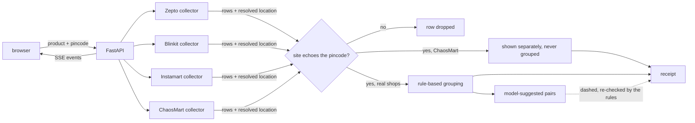

The backend is a single FastAPI process. Runs are stored as JSON and JSONL
under `runs/`, which is ignored by Git. The React frontend is built with Vite
and served by the same process. DESIGN.md is the internal design document the
module docstrings cite by section number; it is kept out of the published
repository.

## API

| Method | Path | Purpose |
| --- | --- | --- |
| `GET` | `/api/health` | Liveness and mode |
| `GET` | `/api/universes` | Available collectors and status |
| `POST` | `/api/runs` | Start a search |
| `GET` | `/api/runs` | List this browser's runs |
| `GET` | `/api/runs/{id}` | Read a run and its comparison |
| `GET` | `/api/runs/{id}/events` | Stream run events over SSE |
| `GET` | `/api/runs/{id}/artifacts/{name}` | A run's stored artifacts (screenshots) |
| `POST` | `/api/replays/{id}` | Replay a completed run |
| `POST` | `/api/carts` | Start one run per item of a cart, all at once |
| `GET` | `/api/carts` | List this browser's carts |
| `GET` | `/api/carts/{id}` | Read a cart and its run ids |
| `GET` | `/api/chaos` | Demo store rendering and admin state |
| `POST` | `/api/chaos/flip` | Switch the demo store rendering (token, header `X-Chaos-Token`) |
| `POST` | `/api/chaos/heal` | Start a self-heal run for the chaos collector (token, header `X-Chaos-Token`) |
| `GET` | `/chaos` | The demo store itself |
| `GET` | `/chaos/search` | Demo store search results |
| `GET` | `/chaos/product/{id}` | A demo store product page |

## Data and privacy

The app stores the submitted query and pincode, collector responses,
site-resolved location text, and run events. It does not ask for an account or
exact coordinates. Runtime data stays under the ignored `runs/` directory
unless it is deliberately exported.

Runs are scoped to the browser that made them. Each visitor is given one opaque
random cookie, and a run stores only its hash, so the run list and every run
page show that browser's runs and nothing else. **This is not authentication**:
there is no account, clearing cookies starts a new identity and makes the old
runs unreachable, and a run id named in the demo list is public by design. See
[`docs/RUNBOOK.md`](docs/RUNBOOK.md), "Anonymous run ownership".

A public deployment should set conservative rate limits and restrict trusted
proxy headers. See [`docs/RUNBOOK.md`](docs/RUNBOOK.md) for deployment notes.

## Tests

```bash
uv run pytest
npm --prefix web test
bash tests/secret_scan.sh
```

## AI disclosure

Claude and Codex were used during implementation, testing, and documentation,
and they did not stop at the app: the collectors themselves were built by
driving Scraper Studio from coding agents. The agents drafted templates over
Studio's REST API, typed and verified collector code in the browser IDE through
an automated browser, triggered validation runs, watched the job logs, and ran
the flip and heal cycle end to end. The demo video was filmed the same way, by
an agent driving a headless browser against the live site. Scraped results come
from the collectors and are not generated by AI.

## License

MIT. See [LICENSE](LICENSE).
